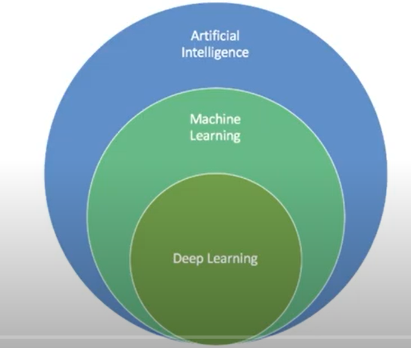
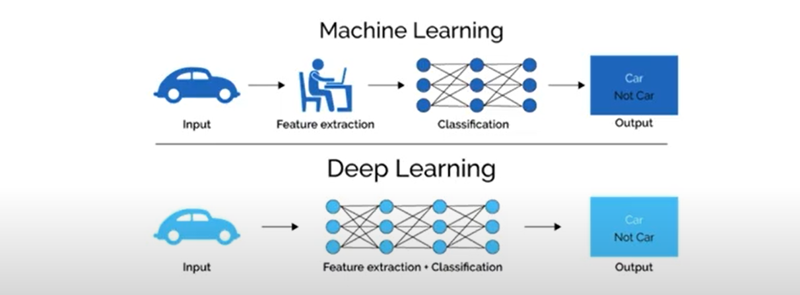
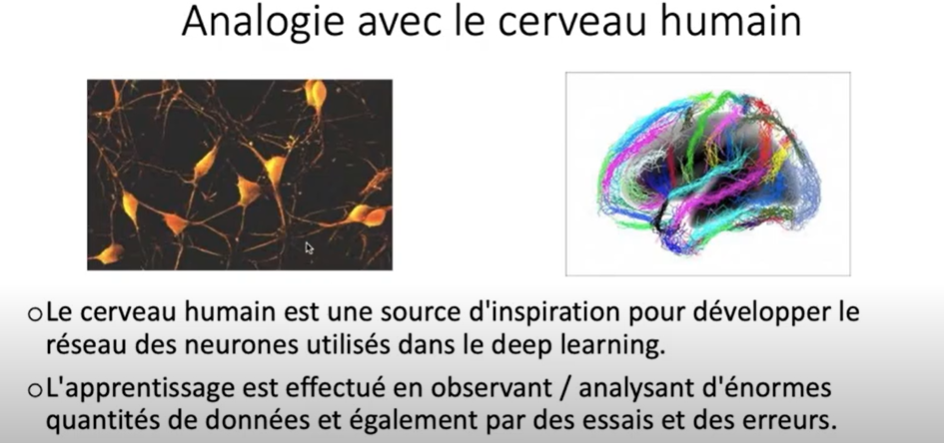
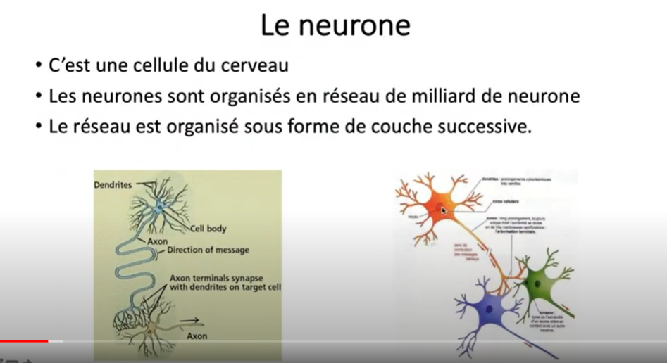
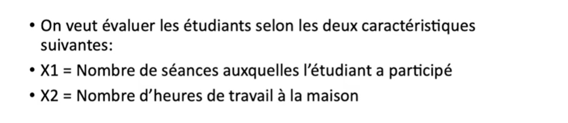
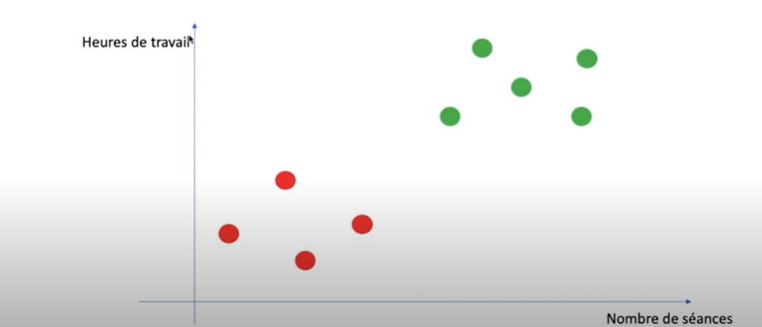
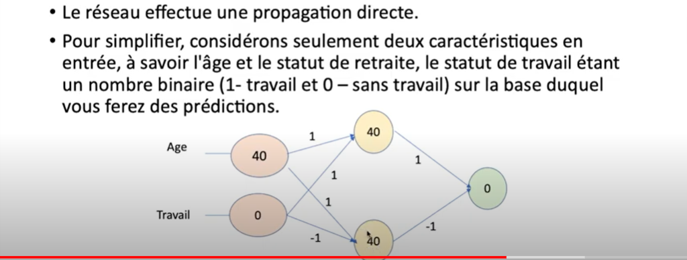
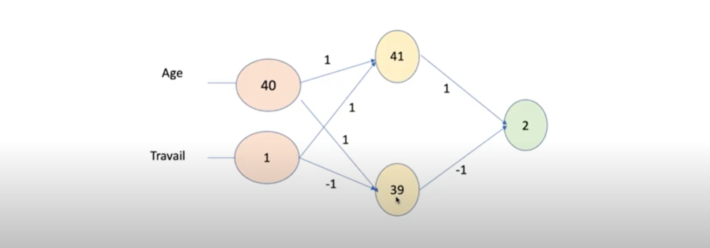
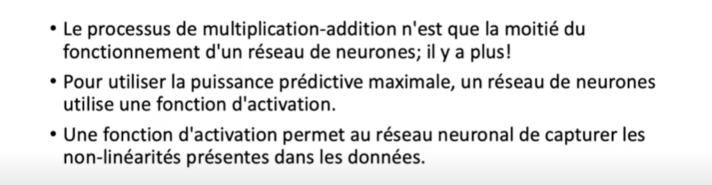
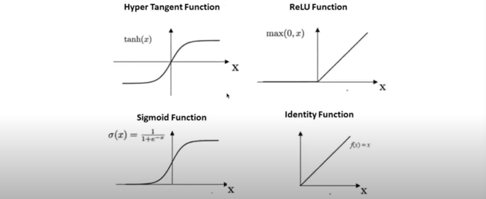

# tensorflow
TensorFlow est une bibliothèque open source de Machine Learning, créée par Google, permettant de développer et d’exécuter des applications de Machine Learning et de Deep Learning. Découvrez tout ce que vous devez savoir à son sujet.

## Plan
* Machine Learning vs Deep Learning
* Applications du Deep Learning
* Notion du neurone
* Exemples Explicatifs
* L'architecture du éseau de neurone
* Apprentissage du réseau de neurone

## Intelligence Artificielle Vs. Machine Learning Vs. Deep Learning
### Intelligence Artificielle
L'**intelligence artificielle (IA)** est un processus d'imitation de l'intelligence humaine qui repose sur la création et l'application d'algorithmes exécutés dans un environnement informatique dynamique. Son but est de permettre à des ordinateurs de penser et d'agir comme des êtres humains.
Pour y parvenir, trois composants sont nécessaires :
* Des systèmes informatiques
* Des données avec des systèmes de gestion
* Des algorithmes d'IA avancés (code)
### Machine Learning
Le **Machine Learning** peut être défini comme étant une technologie d’intelligence artificielle permettant aux machines d’apprendre sans avoir été au préalablement programmées spécifiquement à cet effet. Le Machine Learning est explicitement lié au Big Data, étant donné que pour apprendre et se développer, les ordinateurs ont besoin de flux de données à analyser, sur lesquelles s’entraîner.
### Deep Learning
Le **Deep Learning** ( en Français, la traduction est : apprentissage profond) est une forme d’intelligence artificielle, dérivée du Machine Learning (apprentissage automatique). Pour comprendre ce qu’est le Deep Learning, il convient donc de comprendre ce qu’est le Machine Learning.

## Machine Learning Vs. Deep Learning

## Application de Deep Learning

## Le neurone

## Exemple

## Comment ce réseau peut il faire des prévisions ?

## Fonctions d'activations

## Exemple de  fonction d'activation
